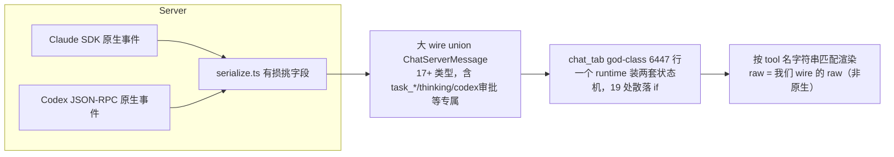
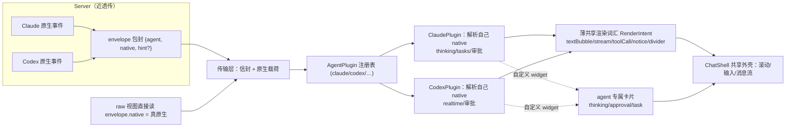

# 对话页多 Agent 架构设计

> 状态：方向已确认（设计文档，非 task 级实施方案）。task 拆解在方向落地各阶段单独成文。
> 适用范围：App 端对话页（Claude / Codex，未来 Gemini 等），以及与之配套的 wire 协议与 server serialize 层。

---

## 1. 背景与问题

对话页当前是"server 有损归一化 + client god-class"的结构，反复产生三类痛点：改 A 影响 B、两边特性飘移、新增/改 agent 要动几十处。量化现状：

| 指标 | 数据 | 含义 |
|---|---|---|
| `app/lib/screens/tabs/chat_tab.dart` | **6447 行** | god-class，13+ 类职责（SSE/分页/observe/审批/上传/queue/runtime 切换/渲染……） |
| `_ChatSessionRuntime` 字段 | 19 通用 + **7 Codex 专属** + **8 Claude 专属** | 一个 runtime 装两套状态机 |
| `AgentKind.codex/claude` 分支 | **19 处**，散在 10+ 方法 | 改一处易漏另一处 |
| 双轨函数 | `_sendNow`（含 55 行纯 Codex sessionId 重映射）、`_switchModel`、`_handleWireMessage` | 两条不同逻辑塞一个函数 |
| Claude 专属 provider | 4 个**全局单例**，靠 `_isActiveClaudeRuntime` 守卫 | 串页 bug 的结构性根源 |
| `server/src/agents/claude/serialize.ts` | `messageToWire()` 逐字段挑拣 | **原生事件结构在此被丢弃** |

**根本病因：抽象边界放在了 server 的有损归一化层**，且公共 wire union 被 agent 专属类型污染，client 又没有 agent 适配层来承载差异。

### 现状架构（as-is）



---

## 2. 设计目标

1. **raw 看原生**：App 的 raw/debug 视图能看到 SDK / Codex 的**原生事件结构**（而非被 server 改写过的二手 wire）。
2. **通用渲染复用**：text / streaming / tool 卡这类两边一致的渲染只写一遍。
3. **特性按 agent 自治、可插拔**：thinking、审批、realtime、tasks 等专属特性各 agent 自己实现；新增 agent 不动公共代码；两边机制不一致也能各插各的。

---

## 3. 核心原则

1. **边界下移**：从"server 有损归一化"下移到"client 按 agent 自治适配"。server 趋近透传。
2. **native-first 传输**：wire 用信封承载**原样的原生事件**，不做有损压缩。
3. **薄共享渲染词汇**：不强制 canonical 协议，只定义一小撮 UI 原语（render intent）；各 agent plugin 把自己的 native **映射**进去，映射不了的发自定义 widget。
4. **继承管机制、组合管能力**（关键取舍）：
   - 共享基础设施（SSE/queue/history/scroll/messages）用**基类继承**复用。
   - 特性差异（thinking/approval/realtime/tasks）用**组合 + capability 声明**表达，**不**用"重写方法开关特性"。
   - 理由：特性是正交的（Claude=thinking+审批+tasks，Codex=realtime+审批，未来组合各异），不成线性继承链，硬套会产生脆弱基类 / 被迫空实现问题。
5. **状态按 session/agent 隔离**：agent 专属状态进各自 plugin 的 state，不进全局单例、不进共享 god-runtime。

---

## 4. 目标架构（to-be）



---

## 5. 关键抽象与接口

> 以下为方向性接口草图（Dart 侧为主），最终签名在 P3 从 Claude/Codex 真实差异里抽取，不提前为假想 agent 设计。

### 5.1 传输信封（wire）

```ts
// packages/shared/src/protocol.ts
interface AgentEnvelope {
  agent: 'claude' | 'codex' | 'gemini';
  native: Record<string, unknown>;     // 原始 SDK / Codex 事件，逐字保留 —— raw 视图与 plugin 都读它
  hint?: string;                       // 可选：server 给的粗分类提示，仅加速 client 派发，非权威
}
```
真·通用控制帧（session_ready / error / pong）仍保留为独立类型；`task_*`、`thinking_tokens`、codex 审批等**离开公共 union**，作为 `native` 载荷由各 plugin 解析。

### 5.2 能力声明（组合，不是继承）

```dart
class AgentCapabilities {
  final bool streaming, thinking, approvals, modelSwitch, tasks, realtime, rawEvents;
  const AgentCapabilities({ /* 各特性默认 false */ });
}
```
shell 一律问 `caps.xxx` 决定 UI，禁止 `if (session is ClaudeSession)`。

### 5.3 共享基础设施（继承复用）

```dart
abstract class ChatSessionBase {
  // SSE 订阅/重连、pending queue、历史分页、滚动跟随、messages 存储、observe/takeover —— 通用，子类复用不重写
}
```

### 5.4 Agent 插件（自治适配）

```dart
abstract class AgentPlugin {
  AgentKind get kind;
  AgentCapabilities get capabilities;
  AgentSessionState createState();                       // 专属状态容器（Codex 审批表 / Claude thinking 等）

  // 把一条原生事件 → 共享 intent + 可选自定义 widget + 状态副作用
  AgentRenderResult handle(AgentEnvelope native, AgentSessionState state);

  Future<void> send(SendParams p, AgentSessionState state);   // 不支持的能力返回 unsupported
}
```

### 5.5 薄共享渲染词汇

```dart
sealed class RenderIntent {}     // textBubble / streamingText / toolCall(name,input,result) / notice / divider / approval
// plugin 映射得出 RenderIntent → ChatShell 统一渲染；映射不出的走 customWidget
```

---

## 6. 数据流与 raw

- **渲染流**：`native` → `plugin.handle()` → `RenderIntent`（共享渲染）或 `customWidget`（专属渲染）。
- **raw 流**：raw/debug 视图**直接读 `envelope.native`**，显示真原生结构（Codex 是 JSON-RPC 形状，Claude 是 SDK message 形状）。
- **带宽**：`native` 比挑过的字段大；raw 不需要时可不挂或按需挂（受 `capabilities.rawEvents` / 调试开关控制）。

---

## 7. 机制不一致如何插拔

| 特性 | Claude 原生机制 | Codex 原生机制 | 插拔方式 |
|---|---|---|---|
| **审批** | canUseTool control-request | `item/…/requestApproval` JSON-RPC | 两 plugin 各把 native 映射成同一个 `ApprovalIntent` → **一套审批卡**（根治两边审批 UI 飘移） |
| **思考** | thinking block / thinking_tokens | 无 | Claude 声明 `thinking=true` 发 thinking widget；Codex 声明 false，shell 不显示 |
| **后台任务** | SDK task_* 生命周期 | 无 | Claude plugin 内部消化，状态进自己的 state，不进公共 runtime |
| **realtime 快照** | 无 | item/started→completed 增量 upsert | Codex plugin 内部消化 |

**验收标准**：新增一个 agent = 写一个 `AgentPlugin` + 一组 `AgentCapabilities` + 若干自定义 widget，**不碰 ChatShell、不碰其它 plugin、不碰公共 wire union**。

---

## 8. 现状 vs 目标

| 维度 | 现状 | 目标 |
|---|---|---|
| 抽象边界 | server 有损归一化 | client per-agent 适配 |
| 原生保真 | ❌ 丢失 | ✅ `envelope.native` |
| 公共协议 | 大 union，被专属类型污染 | 薄信封 + 薄渲染词汇 |
| 新增 agent 成本 | 改几十处 | 写一个 plugin |
| 机制不一致 | 散落 if 硬扛 | capability 声明 + plugin 自洽 |
| 共享渲染 | 混在一起 | 保留（intent 层） |
| agent 专属状态 | 全局单例 + god-runtime | per-plugin / per-session state |

---

## 9. 落地顺序（绞杀式，非大爆炸）

> 三步在同一方向上，但解耦发货：先吃便宜的、零风险的，再做治本的重构。

### P1 — 止血（最高优先，独立可发）
- 把漏的 Claude 专属全局单例 provider（`claudeSessionStatusProvider` / `thinkingTokensProvider` / `toolProgressProvider` / `tasksProvider`）改为 **session-scoped（family by sessionKey）或挂到 runtime 扩展**，从结构上消灭串页类 bug。
- 现已有的 `_isActiveClaudeRuntime` 守卫是补丁（治标），P1 之后可逐步移除。
- **不需要等大重构，立即受益。**

### P2 — native 透传（加法、零风险、独立可发）
- `protocol.ts` 加 `AgentEnvelope.native` 字段；serialize 层在重组时**把原始事件挂上 `native`**（趋近透传）。
- App raw/debug 视图改读 `native` → 看真原生。
- 满足"raw 看原生"目标，**不依赖 plugin 重构**。

### P3 — 绞杀式 plugin 重构（治本、分阶段）
1. 立 `ChatSessionBase` / `AgentPlugin` / `AgentCapabilities` / `RenderIntent` 接口与 `ChatShell` 外壳。
2. **先搬 Codex**（专属逻辑最自洽：realtime + approval 一族）进 `CodexPlugin`，跑通。
3. **再搬 Claude**（thinking/tasks/审批）进 `ClaudePlugin`。
4. 删除 god-class 里的散落分支与双轨函数，runtime 专属字段回各自 plugin state。
- 配套：审批做成"capability + 一套审批卡"，统一 Claude（见权限对齐方案）与 Codex 审批。

---

## 10. 风险与防过度设计护栏

1. **YAGNI**：不为 2 个 agent 提前设计通用框架。plugin 接口**从 Claude/Codex 真实差异抽取**，等真能看见第三个 agent 的形状再让接口为它弯腰。
2. **渲染词汇边界是成败点**：太薄→各 agent 复制渲染；太厚→退回有损 canonical。边界**按实际共同点定**（text/stream/tool 共有，审批/thinking/realtime 专属），不可拍脑袋。
3. **client 解析 native → 与 SDK/Codex 原生形状耦合**：但该耦合**关在单个 plugin 内**，且现状本就是 server 在耦合，只是换位置并顺手隔离。
4. **重构不可大爆炸**：6447 行 god-class 必须绞杀式替换，每步保持可运行、可回归。

---

## 11. 与其它在研方案的关系

- **权限对齐方案**（`docs/superpowers/plans/2026-06-19-claude-permission-alignment.md`）：其 Claude 工具审批正好是验证本架构的样本——在目标架构里它是 `ApprovalCapability` + 一套审批卡，而非又一个独立实现。建议实现时即按"统一审批 intent"对齐，避免与 Codex 审批飘移。
- P1 的 provider 隔离与本仓近期"全局 provider 串页"修复同源，是其结构性收尾。
